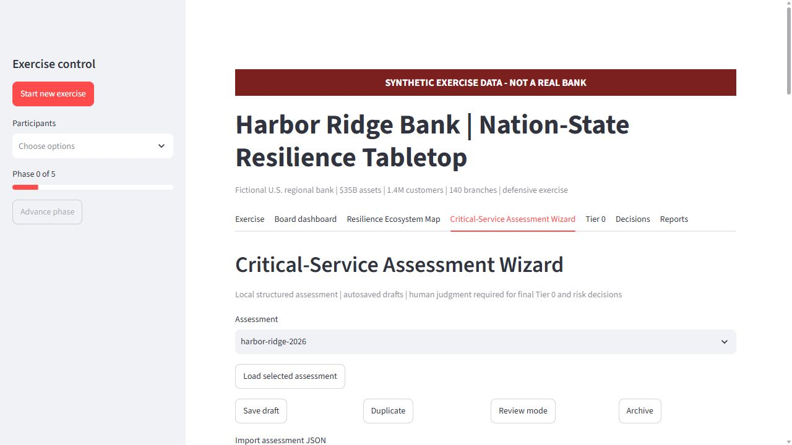
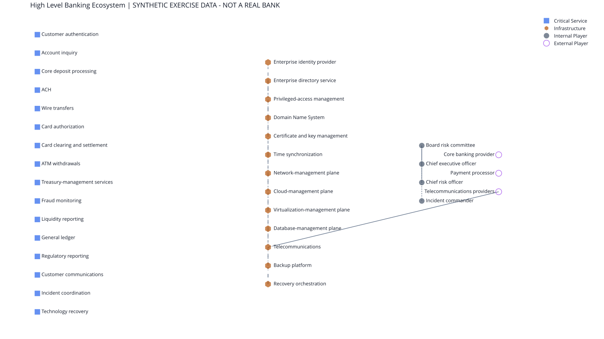
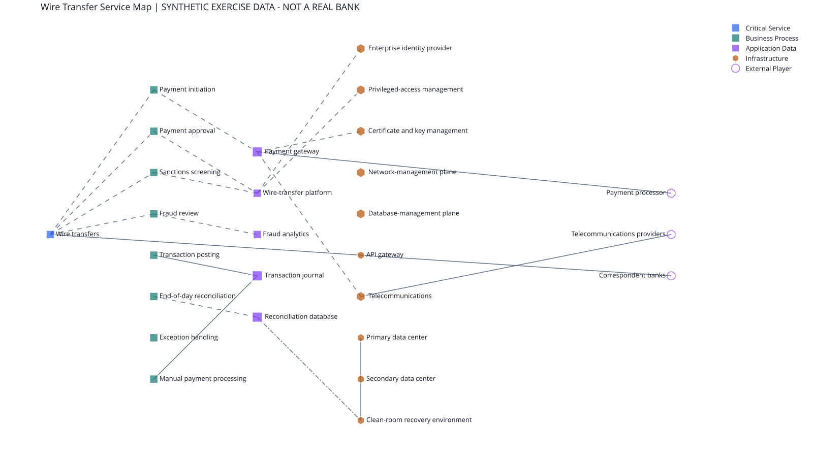
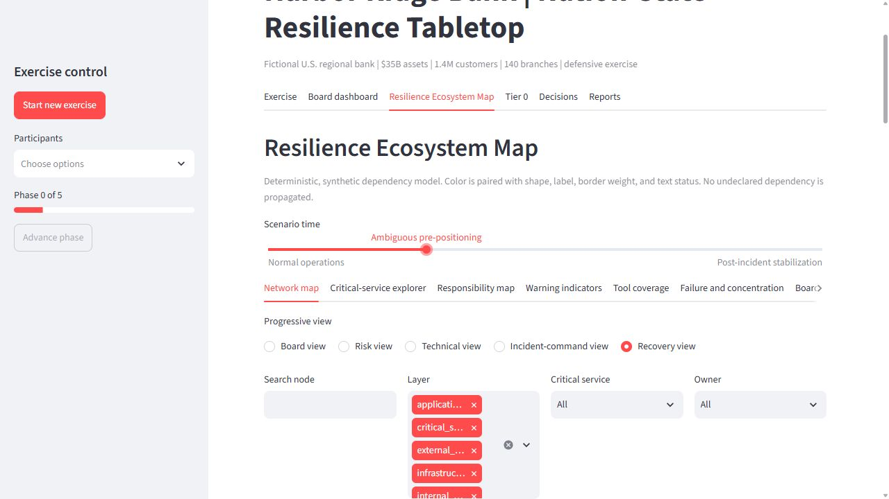

# Harbor Ridge Bank Nation-State Resilience Tabletop

## Critical-Service Assessment Wizard

Phase 3 adds a verified self-service, local, 16-step Streamlit wizard. Users can create blank assessments; create, inspect, edit, duplicate, archive, and confirmation-delete assessment records; select relationships and evidence references; save versioned drafts atomically; resume after restart; and validate, preview, confirm, and export template-specific CSV imports. It converts validated responses into a critical-service register, time-horizon impact analysis, dependency and responsibility maps, Tier 0 candidate recommendations, evidence-based findings, scenario recommendations, corrective actions, and Markdown/PDF board packets. It never produces a universal risk score or finalizes Tier 0 status automatically.

The tracked Harbor Ridge assessment is entirely fictional and synthetic. Real local drafts are stored only in Git-ignored `data/private_assessments/`; never enter secrets, credentials, regulated customer data, or sensitive production architecture.

Run `streamlit run app.py`, then open **Critical-Service Assessment Wizard**. See [the wizard guide](docs/assessment-wizard-guide.md), [bulk import guide](docs/bulk-import-guide.md), and [demo script](docs/wizard-demo-script.md). CSV templates with field guidance are in `templates/assessment/`.



> **SYNTHETIC EXERCISE DATA - NOT A REAL BANK.** Harbor Ridge Bank, all systems, vendors, people, values, evidence, domains, and events are fictional. This defensive project makes no claim about a real institution.

An interactive four-hour executive tabletop and board risk framework translating cyber control-plane dependencies into customer, payment, liquidity, integrity, and recovery decisions.



The executive map starts with critical services, approved Tier 0 concentrations, principal owners, and major outside dependencies. Open the application for searchable progressive disclosure and synchronized detail panels.

## Business problem and audience

A regional bank can appear available while its data is untrustworthy, or fail over quickly into the same compromised administrative plane. Board risk committees, executives, cyber and technology leaders, business continuity, payments, treasury, fraud, legal, compliance, communications, third-party risk, and incident commanders use this exercise to test those dilemmas without attack instructions.

The fictional Harbor Ridge Bank has approximately $35B in assets, 1.4M retail customers, commercial banking, 140 branches, ATMs, ACH, wires, cards, treasury management, a call center, hybrid cloud/on-premises operations, third-party processors, a hybrid workforce, and diverse telecommunications.

## Scenario and exercise

Geopolitical conflict produces strategic warning and ambiguous pre-positioning, then coordinated identity, channel, payment, carrier, integrity, and recovery disruption. Six phases deliver 30 timed, progressively revealed injects over 240 minutes: strategic warning (30), ambiguous pre-positioning (40), coordinated disruption (45), integrity uncertainty (45), containment dilemma (40), and recovery/restoration (40).

The application selects participants, reveals evidence, logs decisions, assumptions and dissent, tracks questions, updates services and indicators, calculates explicit tolerance breaches, and produces a board packet and after-action report. It never treats algorithmic output as unquestionable judgment.

## Tier 0 methodology

1. Identify critical business services.
2. Define MTD, RTO, RPO, minimum viable service, data uncertainty, backlog, harm, loss, liquidity, regulatory, and manual-workaround tolerances.
3. Map technology, identity, control plane, data, people, facility, carrier, payment-network, third-party, and reconciliation dependencies.
4. find concentration and common-mode failure.
5. Apply explainable rules: multi-service failure, broad authority, trusted-recovery dependence, or integrity/reconciliation consequence.
6. Require owner evidence and human approval.

“Tier 0” is Harbor Ridge’s institution-specific operational designation. It is not a universal regulatory term and is distinct from NIST CSF Implementation Tiers. RTO is a target; MTD is the point beyond which harm becomes intolerable. Neither availability, backups, replication, nor failover proves integrity.

## Board value

The board view connects services affected, tolerances consumed, Tier 0 exposure, payment and liquidity effects, integrity and recovery confidence, third parties, deadlines, residual risk, management actions, and board decisions. Red/amber/green is used only with published thresholds. Technical alert volume is excluded unless it supports a risk decision.

## Interactive resilience ecosystem map

The **Resilience Ecosystem Map** adds deterministic Board, Risk, Technical, Incident-command, and Recovery views; a critical-service explorer; RACI responsibility map; scenario animation; warning matrix; tool-coverage maturity; concentration and recovery-paradox views; investment comparisons; and accessible table fallbacks. See the [map guide](docs/ecosystem-map-guide.md), [legend](docs/visual-legend.md), and [interactive demonstration](docs/interactive-demo-script.md).



Legend: square = service/process/application/data, hexagon = infrastructure, diamond = security capability, filled circle = internal player, outlined circle = external player; large thick-bordered nodes are Tier 0. Status always includes a text marker. Dashed edges indicate dependency, dotted edges monitoring/escalation, and dash-dot edges recovery. Static images are synthetic repository-safe views; the live app supplies zoom, filters, selection, phase state, details, and export.



## Install and run

```bash
python -m venv .venv
.venv/Scripts/activate
pip install -e .
streamlit run app.py
```

Docker: `docker build -t harbor-resilience .` then `docker run -p 8501:8501 harbor-resilience`.

Start a new exercise, select participants, reveal each inject, record decisions and dissent, update affected services, advance phases, and export reports. To customize the fictional bank, edit the labeled YAML under `data/`; keep identifiers unique, owners/evidence present, tolerances explicit, and all content synthetic.

Generate the completed synthetic example with `python scripts/generate_examples.py`. Outputs are under `examples/`. Use `pytest -q` and `ruff check .` for validation.

## Framework mappings

The exercise maps defensively to NIST CSF 2.0, NIST SP 800-61r3, FFIEC business continuity management, federal banking operational-resilience principles, CISA Cross-Sector CPGs, and MITRE ATT&CK. [The mapping](docs/regulatory-considerations.md) labels regulatory requirements, supervisory guidance, industry frameworks, recommended practices, and exercise assumptions; links point to authoritative sources and are not legal conclusions.

## Screenshots

Run the application locally to capture your environment. The professional board dashboard, progressive exercise controller, Tier 0 rationale, decision log, and report downloads are available as application tabs; no fabricated static screenshot is committed.

## Limitations

This is a portfolio exercise, not legal advice, a regulatory determination, threat attribution, a production continuity plan, or evidence that any control prevents capable compromise. Notification timing is jurisdiction-dependent and reserved for counsel/compliance. Values are illustrative, scoring is decision support, and no performance outcomes exist until participants generate evidence.

## Portfolio relevance

The project demonstrates operational resilience, ERM, banking cybersecurity, BIA, threat modeling, detection, crisis/continuity/recovery, third-party risk, executive decision support, board reporting, program prioritization, and technical account/sales-engineering communication.

Kevin Bailey is a former U.S. Marine, PMP-certified product and program leader, and Georgia Tech graduate student focused on cyber-physical systems security. His background includes infrastructure product management, VxRail, professional services, operational process improvement, and cybersecurity portfolio development.

## Safety and license

No exploit code, intrusion procedure, real indicators, secrets, or customer data are included. See [SECURITY.md](SECURITY.md). MIT licensed.
